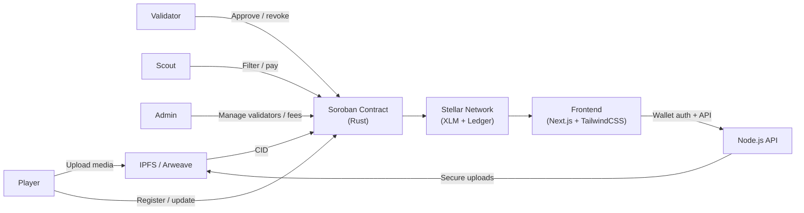

# ScoutOff

[](https://github.com/scout-off/scout-off-frontend/actions/workflows/ci.yml) [](https://codecov.io/gh/scout-off/scout-off-frontend)

**Decentralized football scouting on Stellar.** Tamper-proof player profiles, validator-backed milestones, and direct scout-to-player connections via Soroban smart contracts.

---

## Overview

ScoutOff closes the visibility gap for talented players in underserved regions by creating trusted, searchable profiles backed by on-chain milestones. Players publish highlights via IPFS, while coaches, academies, and certified trainers validate progress through Soroban.

Stellar enables frictionless global payments with sub-cent fees and 3–5 second settlement. Soroban smart contracts manage player registration, milestone verification, subscriptions, and pay-to-contact flows with full auditability.

## Why ScoutOff?

- Modern wallet login: SEP-10 with Freighter, Albedo, and Lobstr
- Decentralized media storage for highlight reels and proof
- On-chain milestone verification by approved validators
- Scout subscriptions and pay-to-contact fees enforced on-chain
- Immutable audit trail stored in Stellar ledger history

## Features

- **Dynamic Player Profiles** — On-chain identity with age, position, region, media, and verified stats
- **Verifiable Progress** — Milestones are recorded by authorized validators
- **Tamper-Proof History** — Immutable audit trail for player progress and approvals
- **Scout Filtering** — Search players by region, position, and progress tier
- **Pay-to-Contact** — XLM micro-fees unlock contact details securely
- **Scout Subscriptions** — Subscription gating prevents spam and supports recurring access
- **Wallet Authentication** — Secure SEP-10 wallet login with supported Stellar wallets
- **Fractionalized Sponsorship** *(future)* — Tokenized player sponsorship for funding and revenue sharing

## Architecture



### Core components

- `registration.rs` — Player and scout onboarding; wallet mapping and media references
- `progress.rs` — Milestone approval and level advancement logic
- `subscription.rs` — Scout subscriptions and pay-to-contact payments in XLM
- `connection.rs` — Scout-player connection agreements and trial offers
- `storage.rs` — Persistent on-chain storage for profiles, milestones, and subscriptions
- `events.rs` — Event emission for off-chain indexing and monitoring

### Progress level model

| Level | Name              | Trigger                                             |
|------:|-------------------|-----------------------------------------------------|
| 0     | Unverified        | Player registers and uploads initial data           |
| 1     | Verified Identity | KYC passed or academy confirms club membership      |
| 2     | Performance       | Approved validator verifies a milestone             |
| 3     | Elite Tier        | Scout logs a trial offer on-chain                   |

## Tech stack

| Layer             | Technology               | Purpose                                                        |
|------------------|--------------------------|----------------------------------------------------------------|
| Smart Contracts  | Rust + Soroban           | On-chain registration, verification, subscriptions, connections |
| Frontend         | Next.js 14 + TailwindCSS | Responsive player/scout dashboards and discovery experience     |
| Backend & Storage| Node.js + IPFS           | Server-side API, IPFS uploads, decentralized media storage      |
| Auth             | Stellar SEP-10           | Secure wallet authentication                                   |
| Payments         | XLM                      | Scout fees, subscriptions, and contact payments                |

## Project structure

```text
scout-off-frontend/
├── app/                 # Next.js App Router pages and API routes
├── components/          # UI components and feature widgets
├── context/             # Wallet and auth state management
├── hooks/               # Reusable contract and UI hooks
├── lib/                 # Stellar, contract, IPFS, API, and sanitization helpers
├── types/               # Shared TypeScript models and interfaces
├── messages/            # i18n translation resources
├── packages/indexer/    # Off-chain event indexing and analytics
├── scripts/             # Environment validation and icon generation
├── public/              # Static assets and PWA manifest
├── .github/             # CI workflows
├── .env.example         # Environment template
├── next.config.js       # Next.js configuration
└── package.json         # Dependencies and scripts
```

> ✅ Modern, decentralized scouting powered by Stellar and Soroban.

## Quick start

For full end-to-end setup, see [DEVELOPMENT.md](DEVELOPMENT.md).

1. Install dependencies

```bash
npm install
```

2. Build smart contracts

```bash
cd ../scout-off-contracts
cargo build --target wasm32-unknown-unknown --release
stellar contract optimize --wasm target/wasm32-unknown-unknown/release/scout_off.wasm
```

3. Deploy to Testnet

```bash
stellar contract deploy \
  --wasm target/wasm32-unknown-unknown/release/scout_off.optimized.wasm \
  --source deployer \
  --network testnet
```

4. Initialize the contract

```bash
stellar contract invoke \
  --id <CONTRACT_ID> \
  --source deployer \
  --network testnet \
  -- initialize \
  --admin <ADMIN_ADDRESS> \
  --platform_token <TOKEN_ADDRESS> \
  --fee_config <FEE_CONFIG>
```

5. Run the frontend

```bash
cp .env.example .env.local
# fill in CONTRACT_ID, PINATA_API_KEY, NEXT_PUBLIC_API_URL, etc.
npm run dev
```

## How it works

1. Player onboarding — connect wallet, upload highlights, register profile.
2. Milestone verification — approved validator records milestones.
3. Scout discovery — filter players, subscribe, or pay to contact.
4. Elite tier — trial offers logged on-chain advance players to Level 3.
5. Admin controls — manage validators, fees, and emergency pause.

## Environment validation

```bash
node scripts/validate-env.js
```

## Configuration

### Quick setup

```bash
cp .env.example .env.local
```

### Key variables

| Variable                   | Description                                            |
|---------------------------|--------------------------------------------------------|
| `NEXT_PUBLIC_CONTRACT_ID`  | Deployed ScoutOff contract address                     |
| `NEXT_PUBLIC_NETWORK`      | `testnet` or `mainnet`                                 |
| `NEXT_PUBLIC_HORIZON_URL`  | Stellar Horizon endpoint                               |
| `NEXT_PUBLIC_SOROBAN_RPC`  | Soroban RPC endpoint                                   |
| `PINATA_API_KEY`           | Pinata API key for IPFS uploads (server-side only)     |
| `PINATA_SECRET`            | Pinata secret for secure server-side uploads           |
| `NEXT_PUBLIC_IPFS_GATEWAY` | IPFS gateway for serving media                         |
| `NEXT_PUBLIC_API_URL`      | Backend API base URL (`http://localhost:4000` default) |
| `PLATFORM_CONTACT_FEE_XLM` | XLM fee for pay-to-contact                              |

## Testing

```bash
npm run test
node scripts/validate-env.js
cd ../scout-off-contracts && cargo test
```

### Coverage targets

- Player registration and profile storage
- Milestone approval and progress level advancement
- Scout subscription and pay-to-contact fee handling
- Trial offer logging and Level 3 transition
- Validator authorization enforcement
- Fee accumulation and admin withdrawal
- Pause / unpause circuit breaker
- Edge cases like duplicate milestones and invalid fees

## Implementation status

| Area                     | Status       | Notes                                                          |
|-------------------------|--------------|----------------------------------------------------------------|
| Config & tooling        | ✅ Complete  | package.json, tsconfig, tailwind, CI, Husky, lint-staged       |
| Types                   | ✅ Complete  | Player, Scout, Milestone, ValidatorInfo, Subscription, Contact |
| Lib layer               | ✅ Complete  | stellar, contract, ipfs, api, sanitize, regions, positions     |
| Wallet context          | ✅ Complete  | Freighter / Albedo / LOBSTR, SEP-10, balance, session restore  |
| Shared components       | ✅ Complete  | Navbar, WalletButton, ProgressBar, PlayerCard, Skeleton        |
| UI primitives           | ✅ Complete  | Modal, Toast, Badge, Button, Spinner, Select, Tooltip, ErrorBoundary |
| Player components       | ✅ Complete  | PlayerProfileForm, UpdateProfileForm, MilestoneTimeline, IPFSMediaGallery |
| Player dashboard        | ✅ Complete  | Register + milestone history                                   |
| Player profile page     | ✅ Complete  | Public view + pay-to-contact                                   |
| Scout dashboard         | ✅ Complete  | Filter form + wallet search + paginated player grid            |
| Scout subscription      | ✅ Complete  | Tier selection + XLM payment via `useSubscription`             |
| Validator components    | ✅ Complete  | ApproveForm, RevokeForm, ValidatorPlayerSearch                 |
| Validator dashboard     | ⚠️ Partial    | Shell only; milestone approval UI needs wiring                 |
| Admin panel             | ✅ Complete  | Add/remove validators, withdraw fees, pause/unpause            |
| Hooks                   | ✅ Complete  | usePlayer, useScout, useValidator, useSubscription, usePayToContact, useMilestoneHistory, useIPFSUpload, useContractHealth, useIsPaused, useDebounce, useRequireWallet |
| Off-chain indexer       | ✅ Complete  | IndexerMetrics with tests in `packages/indexer/`               |
| Frontend tests          | ✅ Complete  | 11 component tests, 3 hook tests, 5 lib tests                  |
| i18n                    | ✅ Complete  | English, French, Swahili via next-intl                         |
| Scout public profile    | 🔲 Not started| `app/[locale]/scout/[id]/` folder created                      |
| Scout ContactModal      | 🔲 Not started| ActivityFeed + ScoutProfileCard exist; modal pending           |
| Trial offer UI          | 🔲 Not started| `log_trial_offer` contract fn ready; UI missing                |
| PWA raster icons        | ⚠️ Partial    | icon.svg exists; raster PNG icons not yet generated            |

## Roadmap

- [x] Player profile registration on Stellar Testnet
- [x] Validator milestone approval and on-chain progress updates
- [x] Scout filtering by region, position, and progress tier
- [x] Scout subscription flow (tier selection + XLM payment)
- [x] Admin panel for validators, fees, circuit breaker
- [x] i18n support — English, French, Swahili
- [x] SEP-10 wallet auth (Freighter, Albedo, LOBSTR)
- [ ] Scout ContactModal + pay-to-contact UI
- [ ] Scout public profile page (`/scout/[id]`)
- [ ] Trial offer logging (Level 3 Elite Tier)
- [ ] Validator dashboard wiring
- [ ] PNG PWA icons generation
- [ ] Fractionalized Player Token sponsorship
- [ ] Mobile-optimized PWA for low-bandwidth regions
- [ ] Mainnet launch

## Dependencies

- `soroban-sdk = "25.3.1"` — Soroban smart contract SDK
- `next = "14.2.3"` — React framework
- `@stellar/stellar-sdk = "12.1.0"` — Stellar JS SDK
- `@stellar/freighter-api = "2.0.0"` — Freighter wallet integration
- `axios = "1.7.2"` — HTTP client for backend API

## Error codes

| Code | Error                | Description                                  | Resolution                          |
|------|----------------------|----------------------------------------------|-------------------------------------|
| 1    | AlreadyInitialized    | Contract already initialized                 | No action needed                    |
| 2    | NotInitialized        | Contract not initialized                     | Initialize contract first           |
| 3    | PlayerNotFound        | Player ID does not exist                     | Verify `player_id`                  |
| 4    | UnauthorizedValidator| Caller is not an approved validator          | Add validator first                 |
| 5    | InvalidMilestone     | Milestone data is empty or malformed         | Provide valid milestone data        |
| 6    | AlreadyAtLevel       | Player already at this level                 | Check current player level          |
| 7    | InsufficientFee      | XLM fee too low                              | Pay required fee                    |
| 8    | SubscriptionExpired  | Scout subscription has lapsed                | Renew subscription                  |
| 9    | ContractPaused       | Contract is paused                           | Wait for unpause                    |
| 10   | Unauthorized         | Caller is not authorized                     | Use correct Stellar account         |
| 11   | NoFeesToWithdraw     | No accumulated platform fees                  | Wait for fee accumulation           |
| 12   | Overflow             | Arithmetic overflow in fee calculation       | Use safe fee range                  |

## Events

| Event                | When it is emitted                                      |
|----------------------|---------------------------------------------------------|
| `player_registered`  | Player creates a new on-chain profile                    |
| `milestone_approved` | Validator writes a verified milestone                   |
| `milestone_revoked`  | Validator or admin removes an erroneous milestone        |
| `scout_subscribed`   | Scout purchases a subscription tier                      |
| `player_contacted`   | Scout pays to unlock player contact details              |
| `trial_offer_logged` | Scout records a trial offer, player reaches Level 3      |
| `fees_withdrawn`     | Admin withdraws accumulated platform fees                |

## License

MIT

## Support

- [GitHub Issues](https://github.com/your-org/scout-off-frontend/issues)
- [Stellar Discord](https://discord.gg/stellar)
- [Stellar Developers](https://developers.stellar.org)

## Contributing

Contributions are welcome! See [CONTRIBUTING.md](CONTRIBUTING.md).

### Contribution checklist

- Frontend tests pass: `npm run test`
- Env validation passes: `node scripts/validate-env.js`
- Contract tests pass: `cd ../scout-off-contracts && cargo test`
- New features include tests and documentation
- Milestone and fee logic changes require explicit review
